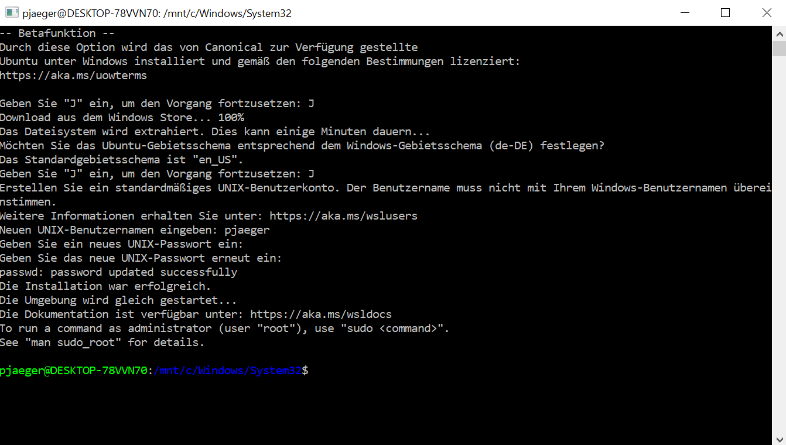

# AlexaEV3Azure
This repository contains the code for the API Bridge on Azure, Alexa Skill and EV3 program.
With this you are able to control an EV3 Bot using Alexa Skill Kit and Azure Webapps
Code is in node.js (web app), Python (EV3)
A big "THANK YOU !" goes to Manuel Rauber @manuelrauber and Christian Weyer @christianweyer. A lot of the code and the initial idea is from them. They used this idea for a talk @ API Summit in June 2017

## Architecture

## API Bridge

## Chat Bot on Azure

## Alexa Skill

## EV3 Program

The [EV3 program](ev3-python) has been written in Python by using the [ev3dev](http://www.ev3dev.org/) operating system. 
The program opens a WebSocket connection to the API Bridge which is used for communication. 

## How to build the basics to get it running

Let's start with setting up your EV3. First of all you need to install [ev3dev](http://www.ev3dev.org/) operating system on your EV3 brick
[ev3dev] is based on Debian Linux and runs also on a Raspberry Pi-powered BrickPi.
[ev3dev] will be installed in a dual-boot environment and runs from a standard microSD card.
For my purpose I bought a 32GB SanDisk Ultra (https://www.amazon.de/gp/product/B013UDL5RU/ref=oh_aui_detailpage_o03_s00?ie=UTF8&psc=1)
On top you will need to buy an mikro USB WLAN Adapter. I got one from Edimax : (https://www.amazon.de/gp/product/B003MTTJOY/ref=oh_aui_detailpage_o03_s00?ie=UTF8&psc=1)
Last but not least you will need an adapter for your PC to write the [ev3dev]Image to the microSD card.
To Flash the CD card and get the Image installed please follow the instructions provided on the [ev3dev] Homepage at (http://www.ev3dev.org/docs/getting-started/)
It's all pretty straight forward and you can't fail (well IF you fail may be you should reconsider workinig on this project :) )

After flashing the SD card with the [ev3dev]Image power up your brick, connect it to your WLAN and SSH into the brick. For a quick how-to please visit (http://www.ev3dev.org/docs/tutorials/connecting-to-ev3dev-with-ssh/)
If you don't like putty or you want some more comfort SSHing you might want to try MobaXterm (http://mobaxterm.mobatek.net/)

After you SSHed into the brick let's update it :
	
	sudo apt-get update
	sudo apt-get install linux-image-ev3dev-ev3

This is the fast version updating JUST the kernel to the most current version. For a full update/upgrate do the following :
	
	sudo apt-get update
	sudo apt-get upgrade
	sudo apt-get dist-upgrade

Escpecially the 2nd line can easily take hours if the distribution is outdated.
With all this done you should be able to run python and use some code to control your brick. Thanks to Ralph Hempel we have Python 2 and Python 3 on the brick. You can find his repository covering Python on thr brick at (https://github.com/rhempel/ev3dev-lang-python)
The next thing we have to install on the Brick is PIP. Please upload get-pip.py from this Repo or from PIP Homepage at (https://pip.pypa.io/en/stable/installing/) into your homefolder on the Brick
Please execute the following :
	
	sudo python get-pip.py

You will be asked for your password (usually it's 'maker'). Getting and installing PIP will take some time. On my Brick it took about 6min after you see the first reaction after hitting the "enter" button.
It should basically look like the following if successful :

You can install PIP for Python3 also using apt-get :
	
	sudo apt-get install python3-pip

it will take almost 30min and requires approx addtl 150MB on your disk.

When this is done we have one final step which is installing the socket.io Client. Please enter the following :

	sudo pip3 install socketIO-client

You'll be asked for your password and it will take another 5-10min to get the socket.io client installed.
The next thing we install is BASH on Windows10. If you're ona Mac you're all set - bash is basically standard. On PC's we have to install it from the Win10 Store.
First you need to make the machine a Dev Machine (in settings). The you need to add BASH in Control Center - Programs - addtl functions. After a restart hit "Win+S" and type "bash". This will start your bash and first will download it from the store. After downloading and adding the standard user it should look like this :

If you need help look here : https://www.howtogeek.com/249966/how-to-install-and-use-the-linux-bash-shell-on-windows-10/
Next we have to prepare your bash environment.

	sudo apt install npm
	sudo apt-get install mc (this is the famous "midnight commander" like good old "Norton Commander")

Although node.js should allready be installed please check before continuing :

	sudo apt-get install nodejs

